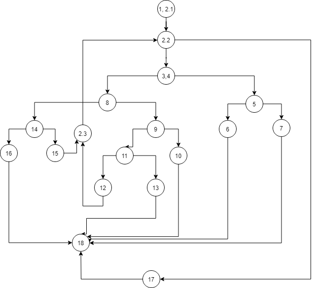
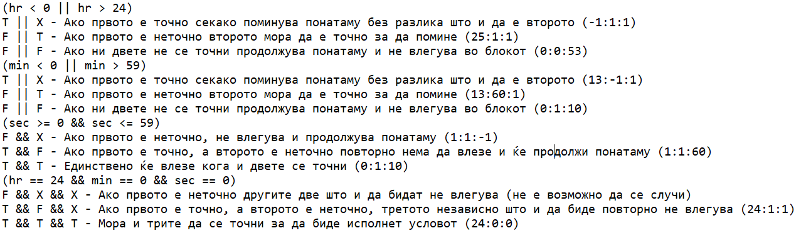
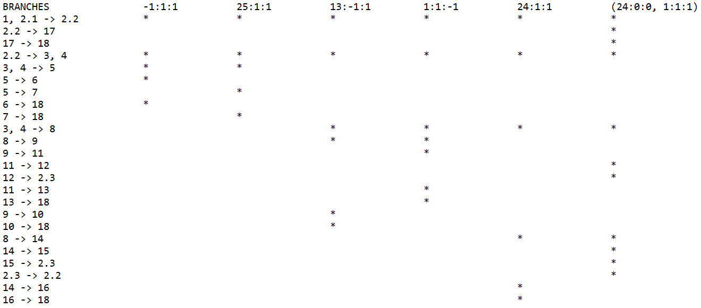

# Втора лабораториска вежба по Софтверско инженерство
## Јордан Иванов, бр. на индекс 162021
### Control Flow Graph

### Цикломатска комплексност
Цикломатската комплексност е 7.Според формулата 6 предикатни јазли + 1.
### Тест случаи според критериумот Multiple condition

### Тест случаи според критериумот Every branch
